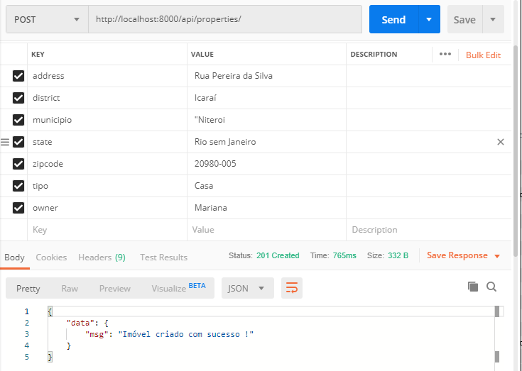
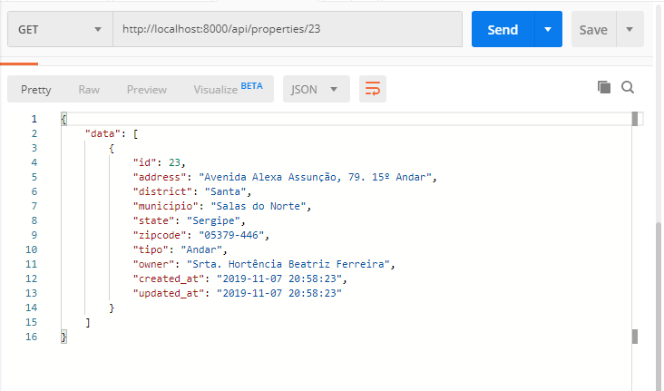
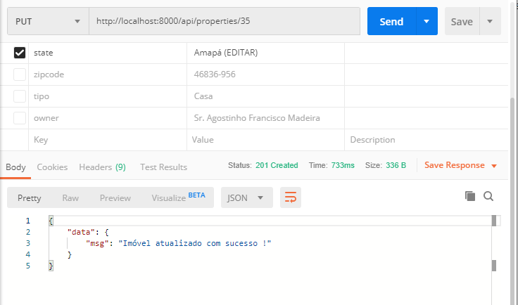
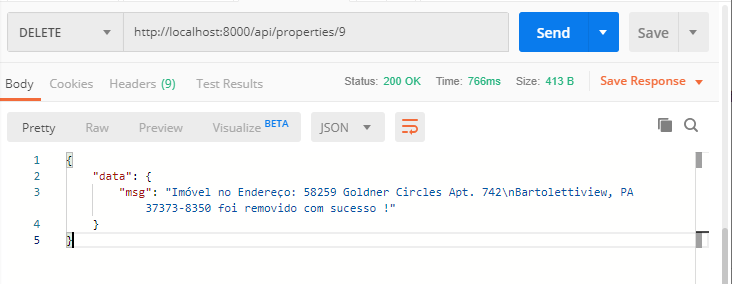

## teste_rest
Esta é uma Aplicação PHP 7.3.11 com Laravel 2.2.0 (Composer 1.9.1)

## Para levantar esta aplicação
Baixe a pasta "<b>teste_rest</b>" para o seu diretório de soluções PHP.

No seu MySQL Administrator, crie uma base da dados e um usuário conforme os  parametros indicados na pagina ".env".

DB_CONNECTION=mysql 
DB_HOST=127.0.0.1 
DB_PORT=3306 
DB_DATABASE=administrator 
DB_USERNAME=base 
DB_PASSWORD=segredo 

Em seguida, execute: <b>php artisan migrate</b> para serem criadas as tabelas do DB.

Com as tabelas criadas, execute: <b>php artisan db:seed</b> para que a tabela "properties" seja populada randomicamente.

Execute o comando: <b>php artisan serve</b> para levantar a aplicação.

No navegador, vá em <b>http://localhost:8000/api/properties</b> para visualizar os dados da base, <b>paginados de 10 em 10 itens</b>.

Acrescentando-se à URL o sufixo "<b>?district=<seu_texto_filtro></b>" filtramos a pesquisa apenas com os Bairros iguais ao <seu_texto_filtro>.

Acrescentando-se à URL o sufixo "<b>?municipio=<seu_texto_filtro></b>" filtramos a pesquisa apenas com os Municípios iguais ao <seu_texto_filtro>.

Acrescentando-se à URL o sufixo "<b>?page=3</b>" traremos apenas os itens da página 3, e assim sucessivamente.

Acrescentando-se à URL o sufixo "<b>?sort=asc</b>" traremos os itens ordenados por Bairro e Município, de forma crescente e se "<b>?sort=desc</b>", os itens virão ordenados por Bairro e Município, de forma decrescente.

Todos os filtros funcionaram de forma conjunta, acrescentando-se "<b>&</b>" entre eles.

## Realizando o CRUD
Com a ajuda do POSTMAN, conseguimos vizualizar que a URL http://localhost:8000/api/properties/, em <b>POST</b>, e com os seguintes parametros, insere dados na Base e nos trazem a mensagem de "<b>Imóvel criado com sucesso ! </b>" 

Com a URL <b>http://localhost:8000/api/properties/23</b>, em <b>GET</b>, visualizamos os dados do ID=23. 

 
 

Com a URL <b>http://localhost:8000/api/properties/35</b>, em <b>PUT</b>, editamos os parametros selecionados e recebemos a mensagem resposta "<b>Imóvel atualizado com sucesso !</b>" 

 

Com a URL <b>http://localhost:8000/api/properties/9</b>, em <b>DELETE</b>, conseguimo excluir, do banco, a linha com ID = 9, e recebemos a mensagem resposta "<b>Imóvel no Endereço: 58259 Goldner Circles Apt. 742\nBartolettiview, PA 37373-8350 foi removido com sucesso !</b>" 

 

Obrigado!

Marcio Cunha
(21)9 8662-2088
